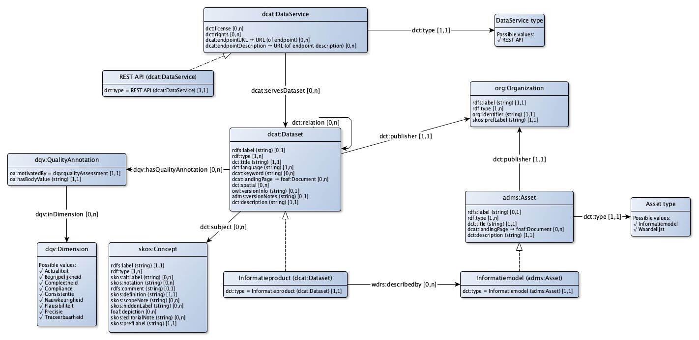

Onderstaand figuur geeft aan hoe de opslagstructuur van een informatieproduct (IP) in elkaar zit:

Dit is een vrij complex model, terwijl feitelijk het opslaan en wijzigen van een IP in de meeste gevallen een stuk eenvoudiger kan. Vandaar de ontwikkeling van een "light" versie van de Informatieproduct API (ip-api-light). Met deze light-variant kan een nieuw informatieproduct geregistreerd worden met de aanroep van 1 API POST, of gewijzigd met 1 API PUT en de betreffende gegevens kunnen opgehaald worden met 1 API GET. Daarbij zijn de volgende beperkingen aangebracht:
- Een IP wordt geserveerd door maximaal één DataService, en wel een REST API;
- Een IP kan maximaal één model hebben;
- Er kan maar 1 kwaliteitsannotatie aangemaakt worden voor elk van de beschreven kwaliteitsdimensies;
- De kwaliteitsdimensies zijn gefixeerd: alleen de hieronder beschreven kwaliteitsdimensies worden ondersteund.

Onderstaande tabel geeft aan hoe deze API in elkaar zit.

|Term|Uitleg|Pad|Waardetype|
|----|------|---|----------|
|-|Type (automatisch)|`rdf:type = adms:Dataset`|owl:Class|
|-|Soort (automatisch)|`dct:type = catalogus:InformatieproductDataset`|skos:Concept|
|-|Publisher (automatisch)|`dct:publisher`|org:Organization|
|term|(Tijdelijk) term t.b.v. de URI-generatie (wordt niet opgeslagen)|-|rdfs:Literal|
|label|Naam van het IP|`rdfs:label`|rdfs:Literal|
|titel|Titel van het IP|`dct:title`|rdfs:Literal|
|onderwerp|De concept(en) waar het IP over gaat|`dct:subject`|skos:Concept|
|website|De website voor dit IP|`dcat:landingPage`|foaf:Document|
|beschrijving|Beschrijving van het IP|`dct:description`|rdfs:Literal|
|onderwerpen|Opsomming van URI's van begrippen die onderwerp zijn van dit IP|`dct:subject`|array of skos:Concept|
|/model/|Type model (automatisch)|`rdf:type = adms:Asset`|owl:Class|
|/model/|Soort model (automatisch)|`dct:type = catalogus:InformatiemodelAsset`|skos:Concept|
|/model/label|Naam van het model van het IP|`wdrs:describedBy/rdfs:label`|rdfs:Literal|
|/model/titel|Titel van het model van het IP|`wdrs:describedBy/dct:title`|rdfs:Literal|
|/model/website|De website voor het model van dit IP|`wdrs:describedBy/dcat:landingPage`|foaf:Document|
|/model/beschrijving|Beschrijving van het model van het IP|`wdrs:describedBy/dct:description`|rdfs:Literal|
|/service/|Endpoint type (automatisch)|`^dcat:servesDataset/rdf:type = dcat:DataService`|owl:Class|
|/service/|Endpoint soort (automatisch)|`^dcat:servesDataset/dct:type = catalogus:RESTAPI`|skos:Concept|
|/service/endpointURL|endpointURL|URL voor primaire endpoint van dit IP|`^dcat:servesDataset/endpointURL`|rdfs:Resource|
|/service/endpointBeschrijving|endpointDescription|URL van de beschrijving van dit endpoint (bv OAS)|`^dcat:servesDataset/endpointDescription`|rdfs:Resource|
|/kwaliteit/|Type kwaliteitsannotatie (automatisch)|`dqv:hasQualityAnnotation/rdf:type = dqv:QualityAnnotation`|owl:Class|
|/kwaliteit/|Kwaliteitsannotatie-motivatie (automatisch)|`dqv:hasQualityAnnotation/oa:motivatedBy = dqv:qualityAssessment`|oa:Motivation|
|/kwaliteit/|Kwaliteitsannotatie-dimensie (automatisch)|`dqv:hasQualityAnnotation/dqv:inDimension`|dqv:Dimension|
|/kwaliteit/actualiteit|Mate van actualiteit|`dqv:hasQualityAnnotation[dqv:inDimension=dimensie:Actualiteit]/oa:hasBodyValue`|rdfs:Literal|
|/kwaliteit/begrijpelijkheid|Mate van begrijpelijkheid|`dqv:hasQualityAnnotation[dqv:inDimension=dimensie:Begrijpelijkheid]/oa:hasBodyValue`|rdfs:Literal|
|/kwaliteit/compleetheid|Mate van compleetheid|`dqv:hasQualityAnnotation[dqv:inDimension=dimensie:Compleetheid]/oa:hasBodyValue`|rdfs:Literal|
|/kwaliteit/compliance|Compliance van het IP|`dqv:hasQualityAnnotation[dqv:inDimension=dimensie:Compliance]/oa:hasBodyValue`|rdfs:Literal|
|/kwaliteit/consistentie|Mate van consistentie|`dqv:hasQualityAnnotation[dqv:inDimension=dimensie:Consistentie]/oa:hasBodyValue`|rdfs:Literal|
|/kwaliteit/nauwkeurigheid|Mate van nauwkeurigheid|`dqv:hasQualityAnnotation[dqv:inDimension=dimensie:Nauwkeurigheid]/oa:hasBodyValue`|rdfs:Literal|
|/kwaliteit/plausibiliteit|Mate van plausibiliteit|`dqv:hasQualityAnnotation[dqv:inDimension=dimensie:Plausibiliteit]/oa:hasBodyValue`|rdfs:Literal|
|/kwaliteit/precisie|Mate van precisie|`dqv:hasQualityAnnotation[dqv:inDimension=dimensie:Precisie]/oa:hasBodyValue`|rdfs:Literal|
|/kwaliteit/traceerbaarheid|Mate van traceerbaarheid|`dqv:hasQualityAnnotation[dqv:inDimension=dimensie:Traceerbaarheid]/oa:hasBodyValue`|rdfs:Literal|

De volgende URI-templates worden gehanteerd:

|Klasse / NodeShape|URI-template|
|------------------|------------|
|Informatieproduct|`http://{$domein}/id/informatieproduct/{$term}`|
|Informatiemodel|`http://{$domein}/id/informatiemodel/{$term}`|
|Dataservice|`http://{$domein}/id/dataservice/{$term}`|
|QualityAnnotation|`http://{$domein}/id/qualityannotation/{$term}-{$dimensie}`|

Hierbij staat `{$domein}` voor het betreffende domein waarbinnen het informatieproduct valt, `{$term}` staat voor de waarde van het API veld `term` (zie in de tabel hierboven) en `$dimensie` voor de naam van de dimensie in lowercase (dus bv `consistentie`).
